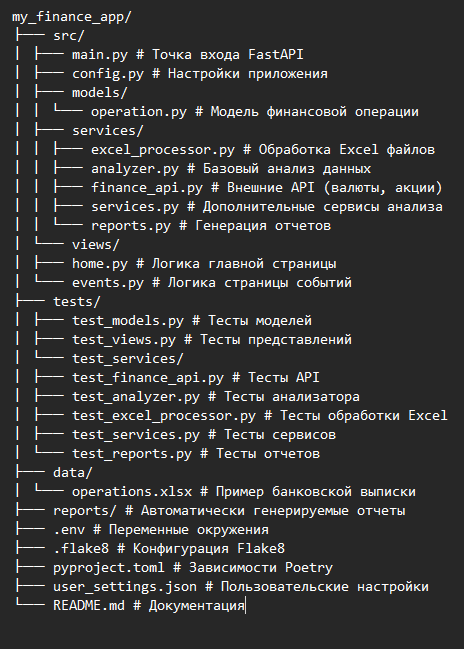

# 🏦 My Finance App

Приложение для анализа личных финансов с интеграцией с банковскими выписками и финансовыми API.

## 🚀 Возможности

### 📊 Основные функции
- Загрузка и анализ банковских выпискок в формате Excel
- Анализ расходов по категориям
- Расчет кэшбэка и бонусов
- Получение актуальных курсов валют
- Мониторинг цен акций
- Фильтрация операций по дате

### 🎯 Сервисы анализа
- **Выгодные категории кешбэка** - анализ наиболее прибыльных категорий
- **Инвесткопилка** - расчет накоплений через округление трат
- **Поиск транзакций** - простой поиск по описанию и категориям
- **Поиск по телефонам** - обнаружение транзакций с номерами телефонов
- **Переводы физлицам** - поиск переводов физическим лицам

### 📈 Отчеты
- **Траты по категории** - анализ расходов по категориям за период
- **Траты по дням недели** - средние расходы по дням недели
- **Рабочие/выходные дни** - сравнение трат в разные типы дней

## 🛠 Технологии

- **FastAPI** - веб-фреймворк
- **Pandas** - обработка данных и анализ
- **Pydantic** - валидация данных
- **Poetry** - управление зависимостями
- **Pytest** - тестирование
- **Mypy** - статическая типизация
- **Logging** - логирование операций

## 📁 Структура проекта



## ⚡ Быстрый старт
### 1. Установка зависимостей
```bash
poetry install
```
### 2. Настройка окружения
#### Создайте файл .env:
```env
EXCEL_FILE_PATH=data/operations.xlsx
SUPPORTED_CURRENCIES=USD,EUR,GBP,CNY
SUPPORTED_STOCKS=AAPL,GOOGL,MSFT,TSLA,AMZN
```
### 3. Запуск приложения
```bash
poetry run python src/main.py
```
 - Приложение будет доступно по адресу: http://localhost:8000
## 📊 API Endpoints
### Основные endpoints
```Text
GET / - Главная страница с аналитикой
GET /events/{date_str} - События с фильтрацией по дате
GET /health - Проверка здоровья приложения
```
## 🎯 Сервисы анализа
```Text
GET /api/cashback-analysis/{year}/{month} - Анализ выгодных категорий кешбэка
GET /api/investment-savings/{month} - Расчет инвесткопилки
GET /api/search?query=текст - Поиск транзакций
GET /api/phone-transactions - Транзакции с телефонными номерами
GET /api/person-transfers - Переводы физическим лицам
```
## 📈 Отчеты
```Text
GET /api/reports/category/{category} - Траты по категории
GET /api/reports/weekdays - Траты по дням недели
GET /api/reports/day-type - Траты в рабочие/выходные дни
```
## 📋 Формат Excel файла
### Файл должен содержать следующие колонки:

 - Дата операции - дата и время операции (формат: DD.MM.YYYY HH:MM:SS)
 - Дата платежа - дата проведения платежа (формат: DD.MM.YYYY)
 - Номер карты - маскированный номер карты
 - Статус - статус операции (OK, FAILED, etc.)
 - Сумма операции - сумма с знаком (- для расходов)
 - Валюта операции - валюта операции (RUB, USD, etc.)
 - Кэшбэк - начисленный кэшбэк
 - Категория - категория операции
 - MCC - код мерчанта
 - Описание - описание операции
 - Бонусы - начисленные бонусы
 - Округление - округление на инвесткопилку

## 🧪 Тестирование
### Запуск всех тестов
```bash
poetry run pytest
```
### Запуск с покрытием
```bash
poetry run pytest --cov=src --cov-report=html
```
### Проверка типов
```bash
poetry run mypy src/
```
### Линтинг
```bash
poetry run flake8 src/
poetry run black --check src/
poetry run isort --check src/
```

## 📊 Примеры использования API
### Анализ кешбэка за январь 2024
```bash
curl "http://localhost:8000/api/cashback-analysis/2024/1"
```
### Расчет инвесткопилки
```bash
curl "http://localhost:8000/api/investment-savings/2024-01?limit=50"
```
### Поиск транзакций
```bash
curl "http://localhost:8000/api/search?query=Такси"
```
### Генерация отчетов
```bash
curl "http://localhost:8000/api/reports/category/Супермаркеты"
curl "http://localhost:8000/api/reports/weekdays"
curl "http://localhost:8000/api/reports/day-type"
```
## ⚙️ Настройка
### Пользовательские настройки
#### Создайте user_settings.json:

```json
{
  "user_currencies": ["USD", "EUR"],
  "user_stocks": ["AAPL", "GOOGL"]
}
```
#### Форматирование кода
```bash
# Автоматическое форматирование
poetry run black src/
poetry run isort src/
```
## 🔮 Примеры использования
### Анализ расходов за месяц
```python
from src.services.excel_processor import load_operations_from_excel
from src.services.analyzer import analyze_spending

operations = load_operations_from_excel("data/operations.xlsx")
analysis = analyze_spending(operations)

print(f"Общие расходы: {analysis['total_spent']}")
print("По категориям:", analysis['by_category'])
```
### Генерация отчетов
```python
from src.services.reports import category_spending_report, transactions_to_dataframe

df = transactions_to_dataframe(transactions)
report = category_spending_report(df, "Супермаркеты", "2024-01-15")
print("Траты по категории:", report)
```
## 📋 Новые эндпоинты API:
 - GET /api/cashback-analysis/{year}/{month} - Анализ кешбэка по категориям

 - GET /api/investment-savings/{month} - Расчет инвесткопилки

 - GET /api/search?query=текст - Поиск транзакций

 - GET /api/phone-transactions - Транзакции с телефонами

 - GET /api/person-transfers - Переводы физлицам

 - GET /health - Проверка здоровья приложения

## 🐛 Troubleshooting
### common issues:
1. Файл не найден - убедитесь что файл operations.xlsx exists в папке data/

2. Ошибки формата - проверьте структуру Excel файла

3. Проблемы с API - при ошибках сети используются fallback значения

### Логирование
#### Для debug добавьте логирование в нужных модулях:

```python
import logging
logging.basicConfig(level=logging.DEBUG)
```
## 📄 Лицензия
MIT License

## 🤝 Contributing
 - Форкните репозиторий

 - Создайте feature branch

 - Commit your changes

 - Push to the branch

 - Create a Pull Request

